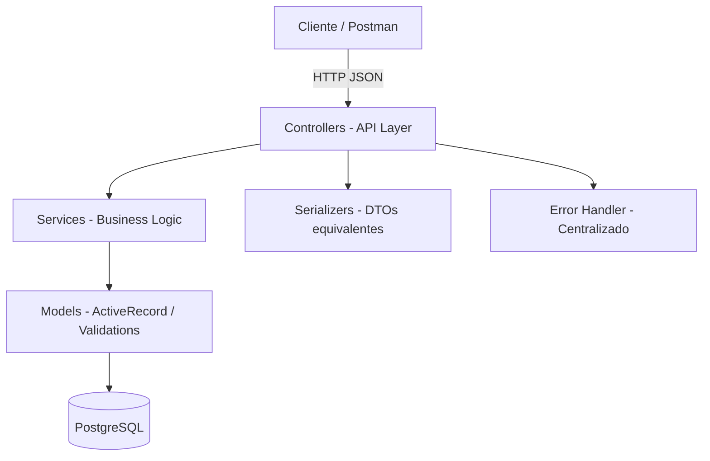

# 🛒 E-Commerce API — Grupo 7

**API RESTful de E-commerce** construida con **Ruby on Rails 7.1** (API mode)

## 👥 Integrantes

| Nombre | Rol |
|---|---|
| Estéfano Condoy | Desarrollo Backend |
| Eddy Sangucho | Desarrollo Backend |
| César Zapata | Desarrollo Backend |

## 🏗️ Arquitectura

El proyecto implementa una **arquitectura por capas** siguiendo las convenciones de Rails:



### Capas del proyecto

| Capa | Ubicación | Responsabilidad |
|---|---|---|
| **Controllers** | `app/controllers/api/v1/` | Recibir requests, delegar lógica, retornar respuestas JSON |
| **Services** | `app/services/` | Lógica de negocio, transacciones, validaciones complejas |
| **Models** | `app/models/` | Entidades, relaciones ActiveRecord, validaciones de datos |
| **Serializers** | `app/serializers/` | DTOs — Transformar modelos a JSON (sin exponer campos sensibles) |
| **Concerns** | `app/controllers/concerns/` | Manejo centralizado de errores y autenticación |
| **Migrations** | `db/migrate/` | Definición y versionamiento del esquema de BD |

## 🛠️ Stack Tecnológico

| Tecnología | Versión | Uso |
|---|---|---|
| Ruby | 3.2.2 | Lenguaje |
| Rails | 7.1 | Framework API-only |
| PostgreSQL | 15+ | Base de datos relacional |
| BCrypt | 3.1.7 | Cifrado de contraseñas (`has_secure_password`) |
| JWT | 2.7 | Autenticación stateless |
| Kaminari | 1.2 | Paginación |
| Rswag | - | Documentación Swagger/OpenAPI |
| RSpec | 6.0 | Testing |
| Docker | - | Contenedorización |

## 📦 Entidades

### User
- `id`, `first_name`, `last_name`, `email`, `password_digest`
- Contraseñas cifradas con BCrypt
- Las contraseñas **nunca** se devuelven en las respuestas

### Product
- `id`, `name`, `description`, `price` (decimal 10,2), `stock`
- Validación de stock al crear recibos

### Receipt
- `id`, `user_id`, `total` (decimal 10,2)
- Total **calculado por el backend**
- El cliente NO envía el total

### ReceiptItem
- `id`, `receipt_id`, `product_id`, `quantity`, `unit_price` (decimal 10,2), `subtotal` (decimal 10,2)
- `unit_price` se toma del precio actual del producto
- `subtotal` = `unit_price × quantity`

## 🔑 Reglas de Negocio

1. **Total calculado en backend**: El cliente envía `user_id` e `items [{product_id, quantity}]`. El backend calcula precios y total.
2. **Validación de stock**: Se verifica stock antes de crear el recibo.
3. **Descuento automático de stock**: Al confirmar el recibo, se descuenta el stock.
4. **Contraseñas cifradas**: BCrypt con `has_secure_password`.
5. **Contraseñas ocultas**: Los serializers nunca exponen `password_digest`.
6. **Precisión monetaria**: `decimal(10,2)` para todos los montos.
7. **Errores centralizados**: Respuestas JSON consistentes con `ExceptionHandler`.

## 📋 Endpoints

### Users
| Método | Ruta | Descripción | Auth |
|---|---|---|---|
| `POST` | `/api/v1/users/register` | Registrar usuario | ❌ |
| `POST` | `/api/v1/users/login` | Iniciar sesión (retorna JWT) | ❌ |
| `GET` | `/api/v1/users/:id` | Obtener usuario | ✅ |
| `PUT` | `/api/v1/users/:id` | Actualizar usuario | ✅ |
| `DELETE` | `/api/v1/users/:id` | Eliminar usuario | ✅ |

### Products
| Método | Ruta | Descripción | Auth |
|---|---|---|---|
| `POST` | `/api/v1/products` | Crear producto | ✅ |
| `GET` | `/api/v1/products` | Listar productos (paginado + búsqueda) | ❌ |
| `GET` | `/api/v1/products/:id` | Obtener producto | ❌ |
| `PUT` | `/api/v1/products/:id` | Actualizar producto | ✅ |
| `DELETE` | `/api/v1/products/:id` | Eliminar producto | ✅ |

### Receipts
| Método | Ruta | Descripción | Auth |
|---|---|---|---|
| `POST` | `/api/v1/receipts` | Crear recibo | ✅ |
| `GET` | `/api/v1/receipts` | Listar recibos | ✅ |
| `GET` | `/api/v1/receipts/:id` | Obtener recibo | ✅ |
| `GET` | `/api/v1/receipts/user/:user_id` | Recibos por usuario | ✅ |
| `DELETE` | `/api/v1/receipts/:id` | Eliminar recibo | ✅ |

## 🚀 Ejecución

### Opción 1: Docker (Recomendado)

```bash
# Clonar el repositorio
git clone <url-del-repo>
cd Grupo7

# Levantar con Docker Compose
docker-compose up --build

# La API estará en http://localhost:3000
# Swagger UI en http://localhost:3000/api-docs
```

### Opción 2: Local

**Prerequisitos:**
- Ruby 3.2.2
- PostgreSQL 15+
- Bundler

```bash
# Instalar dependencias
bundle install

# Configurar variables de entorno
cp .env.example .env
# Editar .env con tus credenciales de PostgreSQL

# Crear y migrar base de datos
rails db:create
rails db:migrate
rails db:seed

# Iniciar servidor
rails server
# La API estará en http://localhost:3000
```

## 🔐 Autenticación JWT

El sistema usa JSON Web Tokens para la autenticación:

1. **Registrar** un usuario en `POST /api/v1/users/register`
2. **Login** en `POST /api/v1/users/login` → recibe un JWT
3. **Incluir** el token en el header: `Authorization: Bearer <token>`

Los tokens expiran después de 24 horas (configurable con `JWT_EXPIRATION_HOURS`).

## 🔒 Variables de Entorno

| Variable | Descripción | Default |
|---|---|---|
| `DB_HOST` | Host de PostgreSQL | `localhost` |
| `DB_PORT` | Puerto de PostgreSQL | `5432` |
| `DB_USERNAME` | Usuario de PostgreSQL | `postgres` |
| `DB_PASSWORD` | Contraseña de PostgreSQL | `postgres` |
| `JWT_SECRET_KEY` | Clave secreta para JWT | - |
| `JWT_EXPIRATION_HOURS` | Horas de expiración del token | `24` |
| `RAILS_ENV` | Entorno de Rails | `development` |

## 📝 Ejemplos de Uso

### Registrar usuario
```bash
curl -X POST http://localhost:3000/api/v1/users/register \
  -H "Content-Type: application/json" \
  -d '{
    "user": {
      "first_name": "Juan",
      "last_name": "Pérez",
      "email": "juan@example.com",
      "password": "password123"
    }
  }'
```

**Respuesta:**
```json
{
  "success": true,
  "data": {
    "id": 1,
    "firstName": "Juan",
    "lastName": "Pérez",
    "email": "juan@example.com",
    "createdAt": "2026-07-17T12:00:00-05:00",
    "updatedAt": "2026-07-17T12:00:00-05:00"
  }
}
```

### Login
```bash
curl -X POST http://localhost:3000/api/v1/users/login \
  -H "Content-Type: application/json" \
  -d '{
    "email": "juan@example.com",
    "password": "password123"
  }'
```

**Respuesta:**
```json
{
  "success": true,
  "data": {
    "id": 1,
    "firstName": "Juan",
    "lastName": "Pérez",
    "email": "juan@example.com",
    "token": "eyJhbGciOiJIUzI1NiJ9..."
  }
}
```

### Crear producto (con JWT)
```bash
curl -X POST http://localhost:3000/api/v1/products \
  -H "Content-Type: application/json" \
  -H "Authorization: Bearer <tu_token_jwt>" \
  -d '{
    "product": {
      "name": "Laptop Gaming",
      "description": "Laptop para gaming de alta gama",
      "price": 1299.99,
      "stock": 15
    }
  }'
```

### Crear recibo (total calculado por el backend)
```bash
curl -X POST http://localhost:3000/api/v1/receipts \
  -H "Content-Type: application/json" \
  -H "Authorization: Bearer <tu_token_jwt>" \
  -d '{
    "receipt": {
      "user_id": 1,
      "items": [
        { "product_id": 1, "quantity": 2 },
        { "product_id": 3, "quantity": 1 }
      ]
    }
  }'
```

**Respuesta:**
```json
{
  "success": true,
  "data": {
    "id": 1,
    "userId": 1,
    "user": {
      "id": 1,
      "firstName": "Juan",
      "lastName": "Pérez",
      "email": "juan@example.com"
    },
    "items": [
      {
        "id": 1,
        "productId": 1,
        "productName": "Laptop HP Pavilion",
        "quantity": 2,
        "unitPrice": 899.99,
        "subtotal": 1799.98
      },
      {
        "id": 2,
        "productId": 3,
        "productName": "Teclado Mecánico Corsair",
        "quantity": 1,
        "unitPrice": 129.99,
        "subtotal": 129.99
      }
    ],
    "total": 1929.97,
    "createdAt": "2026-07-17T12:00:00-05:00"
  }
}
```

### Ejemplo de error (stock insuficiente)
```json
{
  "success": false,
  "error": "Conflicto",
  "message": "Stock insuficiente para 'Laptop HP Pavilion'. Disponible: 25, Solicitado: 999",
  "status": 409,
  "timestamp": "2026-07-17T12:00:00-05:00"
}
```

## 📊 Documentación API

- **Swagger UI**: `http://localhost:3000/api-docs`
- **OpenAPI YAML**: `swagger/v1/swagger.yaml`
- **Postman Collection**: `docs/postman_collection.json` (importar en Postman)

## 🧪 Tests

```bash
# Ejecutar todos los tests
bundle exec rspec

# Ejecutar tests de modelos
bundle exec rspec spec/models

# Ejecutar tests de requests
bundle exec rspec spec/requests

# Ejecutar un test específico
bundle exec rspec spec/models/user_spec.rb
```

## 📁 Estructura del Proyecto

```
Grupo7/
├── app/
│   ├── controllers/
│   │   ├── application_controller.rb     # Base + autenticación JWT
│   │   ├── concerns/
│   │   │   └── exception_handler.rb      # Manejo centralizado de errores
│   │   └── api/v1/
│   │       ├── users_controller.rb       # CRUD usuarios + auth
│   │       ├── products_controller.rb    # CRUD productos
│   │       └── receipts_controller.rb    # Gestión de recibos
│   ├── models/
│   │   ├── user.rb                       # Modelo + validaciones + BCrypt
│   │   ├── product.rb                    # Modelo + validación stock
│   │   ├── receipt.rb                    # Modelo + cálculo total
│   │   └── receipt_item.rb              # Modelo + cálculo subtotal
│   ├── services/
│   │   ├── auth_service.rb              # JWT encode/decode
│   │   ├── user_service.rb              # Lógica de usuarios
│   │   ├── product_service.rb           # Lógica de productos + búsqueda
│   │   └── receipt_service.rb           # Lógica de recibos + transacciones
│   └── serializers/
│       ├── user_serializer.rb           # DTO usuario (sin password)
│       ├── product_serializer.rb        # DTO producto + paginación
│       ├── receipt_serializer.rb        # DTO recibo completo
│       └── receipt_item_serializer.rb   # DTO item del recibo
├── config/
│   ├── database.yml                     # Conexión PostgreSQL
│   ├── routes.rb                        # Rutas REST
│   └── initializers/                    # CORS, Swagger
├── db/
│   ├── migrate/                         # 4 migraciones
│   ├── seeds.rb                         # Datos de ejemplo
│   └── schema.rb                        # Esquema generado
├── docs/
│   └── postman_collection.json          # Colección Postman
├── swagger/v1/
│   └── swagger.yaml                     # OpenAPI 3.0
├── spec/                                # Tests RSpec
│   ├── models/                          # Tests de modelos
│   ├── requests/                        # Tests de endpoints
│   └── factories/                       # Factories (FactoryBot)
├── Dockerfile
├── docker-compose.yml
├── Gemfile
└── README.md
```

## ⚡ Valor Agregado

| Feature | Descripción |
|---|---|
| 📄 Paginación | `GET /api/v1/products?page=1&per_page=10` con Kaminari |
| 🔍 Búsqueda | `GET /api/v1/products?name=laptop` (búsqueda parcial) |
| 🐳 Docker | `Dockerfile` + `docker-compose.yml` para despliegue rápido |
| 🌱 Seeds | Datos de ejemplo con los integrantes del equipo |
| 📖 Swagger | Documentación interactiva OpenAPI 3.0 |
| 📬 Postman | Colección completa con variables y auto-guardado de token |
| 🧪 RSpec | Tests de modelos y requests |
| 🔒 JWT | Autenticación stateless con tokens |

## ⚖️ Licencia

Proyecto académico — Escuela Politécnica Nacional 2026
